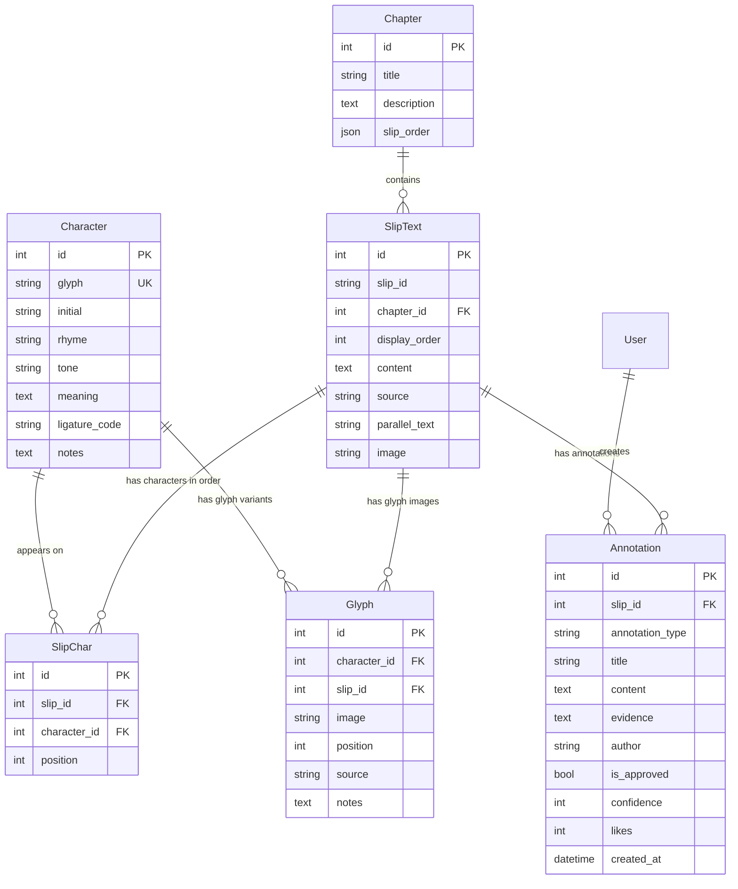

# 📜 先秦出土文献数据库
（反正写了也没人看，就随便写）
首次接触网页开发的练习。
姑且算是个基于 Django 构建的出土文献数字化平台，目标是像著名的苏美尔语在线词典[ePSD2](https://oracc.museum.upenn.edu/epsd2/)那样，做成文字编、辞典和语料库联动的超级系统。
当然，水平所限，这个目标恐怕永远不能完成。
与 DeepSeek V4 Flash 网页端共创。已支持竹简释文的按篇管理、上古音注音、古文字字形图片对照、集释众包等功能。

## ✨ 项目目标
- **篇目管理**：按篇组织竹简，支持调整分篇及编联
- **释文浏览**：篇-简-字三级结构，支持关键词全文搜索、结果高亮
- **上古音注音**：每个字的声母、韵部、古音，古文字所处谐声域，在释文中以振假名样式显示
- **图文对照**：包括显示竹简图片，以及古文字字形图片、隶定字动态组字图片、释文对照显示
- **集释系统**：学者可前台提交释读意见及所用证据，管理员审核后展示，支持释读与证据置信度评分和评论、点赞
- **字符索引**：点击释文中的字，可查看该字的音韵信息、字形、字频、出现位置等

## 🛠️ 技术栈
都是皮毛级的
- **后端**：Python 3.14，Django 6.0.7
- **数据库**：Django自带的SQLite
- **前端**：基础HTML与CSS， Django模板引擎
- **排序**：django-admin-sortable2（后台拖拽排序）
- **版本管理**：Git + GitHub

## 📁 数据模型
整个数据结构大概是这样的：


## 🚀 简单导入数据
现在项目已经支持一个更容易上手的导入方式。

### 1. 准备一个文本文件
把你的数据写成下面这种格式：

```text
chapter: 曹沫之阵
简1 | 甲乙丙丁
简2 | 戊己庚辛
```

把文件保存为例如 `sample_import.txt`，放到项目根目录。

### 2. 运行导入命令
```powershell
py import_simple.py --file sample_import.txt
```

如果你想重置这个篇目下旧数据再导入：

```powershell
py import_simple.py --file sample_import.txt --reset
```

### 3. 说明
- `chapter:` 后面写篇名
- 每行用 `|` 分隔：`简号|内容`
- 脚本会自动创建篇目、竹简、字和字位关系
- 默认会跳过标点，方便做基础导入

## 📖 预计主要参考文献
- 楚地出土战国简册（十四种），陈伟 等，经济科学出版社，2009
- [上海博物馆藏楚简校注](https://pan.baidu.com/s/1csBnM3fYIsYaRU28u0zSmg)，余绍宏，中国社会科学出版社，2016
- ......
