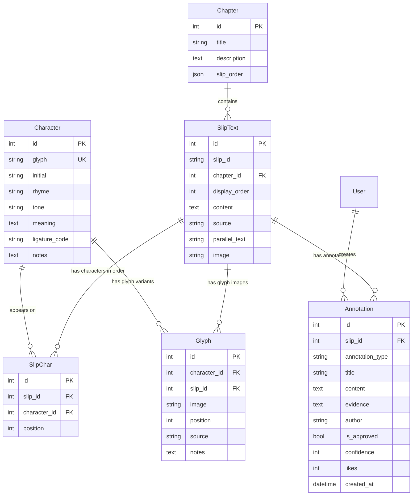

# 📜 先秦出土文献数据库
（反正写了也没人看，就随便写）

首次接触网页开发的练习。暂时托管于[PythonAnywhere](aengmore.pythonanywhere.com)。

姑且算是个基于 Django 构建的出土文献数字化平台，目标是像著名的苏美尔语在线词典[ePSD2](https://oracc.museum.upenn.edu/epsd2/)那样，做成文字编、辞典和语料库联动的超级系统。当然，水平所限，这个目标恐怕永远不能完成。

与 DeepSeek V4 Flash 网页端共创。（说是共创，其实因为我零基础，全是D导手把手教我做的。）已支持竹简释文的按篇管理、上古音注音、古文字字形图片对照、集释众包等功能。

## ✨ 项目目标
- **篇目管理**：按篇组织竹简，支持调整分篇及编联
- **释文浏览**：篇-简-字三级结构，支持关键词全文搜索、结果高亮
- **上古音注音**：每个字的声母、韵部、古音，古文字所处谐声域，在释文中以振假名样式显示
- **图文对照**：包括显示竹简图片，以及古文字字形图片、隶定字动态组字图片、释文对照显示
- **集释系统**：学者可前台提交释读意见及所用证据，管理员审核后展示，支持释读与证据置信度评分和评论、点赞
- **字符索引**：点击释文中的字，可查看该字的音韵信息、字形、字频、出现位置等

## 🛠️ 技术栈
都是皮毛级的
- **后端**：Python 3.14，Django 6.0.7
- **数据库**：Django自带的SQLite
- **前端**：Vue 3、Vue Router、Vite；复用 `texts/static/texts/css/style.css`
- **API**：Django REST Framework
- **排序**：django-admin-sortable2（后台拖拽排序）
- **版本管理**：Git + GitHub

## ⚙️ 运行配置
前后端开发需分别启动 Django 和 Vite。Django 提供 `/api/`、`/admin/` 和媒体文件，Vite 将 API、媒体和静态资源请求代理给 Django。

PowerShell 终端一（在 Python 虚拟环境中）：

```powershell
cd d:\program\web\bamboo
python manage.py runserver 8000
```

PowerShell 终端二：

```powershell
cd d:\program\web\frontend
npm ci
npm run dev
```

访问 Vite 输出的地址（默认 `http://localhost:5173`）。生产构建输出至 `texts/static/texts/vue/`，原有访客 URL 由 Django 返回 Vue 应用入口。

生产环境必须设置 `DJANGO_DEBUG=False`、`DJANGO_SECRET_KEY`、`DJANGO_ALLOWED_HOSTS` 和数据库连接变量；通过 `DB_ENGINE`、`DB_NAME`、`DB_USER`、`DB_PASSWORD`、`DB_HOST` 和 `DB_PORT` 配置 PostgreSQL。静态文件通过 WhiteNoise 服务；媒体文件仍需由 PythonAnywhere 的静态文件映射或生产文件服务器提供。

发布到 PythonAnywhere 前，在本机或构建环境运行：

```powershell
npm --prefix ..\frontend ci
npm --prefix ..\frontend run build
python manage.py collectstatic --noinput
```

PythonAnywhere 的 Web 配置中将 URL `/static/` 映射到 `STATIC_ROOT`。新增静态文件或再次构建 Vue 后，需重新运行 `collectstatic`。

Docker 构建上下文需同时包含同级的 `bamboo/` 和 `frontend/` 目录；从 `web/` 目录运行：

```powershell
docker build -f bamboo/Dockerfile -t bamboo .
```

镜像构建时会编译 Vue 并收集 Django 静态文件；运行容器时仍需传入生产密钥、允许的主机和数据库配置。

生产密钥可用 `python -c "import secrets; print(secrets.token_urlsafe(50))"` 生成，并单独配置到运行环境中，不要提交到版本库。

若本地需要连接 PostgreSQL，可在 PowerShell 中设置：

```powershell
$env:DJANGO_DEBUG = "True"
$env:DB_ENGINE = "django.db.backends.postgresql"
python manage.py runserver
```

## 📁 数据模型
整个数据结构大概是这样的：

```mermaid 
erDiagram
    Chapter ||--o{ SlipText : contains
    SlipText ||--o{ SlipChar : "has characters in order"
    SlipText ||--o{ Glyph : "has glyph images"
    SlipText ||--o{ Annotation : "has annotations"
    Character ||--o{ SlipChar : "appears on"
    Character ||--o{ Glyph : "has glyph variants"
    
    Chapter {
        int id PK
        string title
        text description
        json slip_order
    }
    
    SlipText {
        int id PK
        string slip_id
        int chapter_id FK
        int display_order
        text content
        string source
        string parallel_text
        string image
    }
    
    Character {
        int id PK
        string glyph UK
        string initial
        string rhyme
        string tone
        text meaning
        string ligature_code
        text notes
    }
    
    SlipChar {
        int id PK
        int slip_id FK
        int character_id FK
        int position
    }
    
    Glyph {
        int id PK
        int character_id FK
        int slip_id FK
        string image
        int position
        string source
        text notes
    }
    
    Annotation {
        int id PK
        int slip_id FK
        string annotation_type
        string title
        text content
        text evidence
        string author
        bool is_approved
        int confidence
        int likes
        datetime created_at
    }
    
    User ||--o{ Annotation : creates
```

## 🚀 简单导入数据
现在项目已经支持一个更容易上手的导入方式。

### 1. 准备一个文本文件
使用下述格式：

```text
## 上博简
### 曹沫之阵
1:甲乙丙丁
2:戊己庚辛

## 郭店简
### 老子甲
1:甲乙丙丁
```

把文件保存为例如 `sample_import.txt`，放到项目根目录。

### 2. 运行导入命令
```powershell
py import.py --file sample_import.txt
```

### 3. 说明
- `##` 后面写批次名（如上博简、郭店简），`###` 后面写篇名；也可以用 `chapter:` 写篇名
- 每行用 `|` 分隔：`简号|内容`
- 脚本会自动创建篇目、竹简、字和字位关系
- 默认会跳过标点，方便做基础导入

## 📖 预计主要参考文献
- 楚地出土战国简册（十四种），陈伟 等，经济科学出版社，2009
- [上海博物馆藏楚简校注](https://pan.baidu.com/s/1csBnM3fYIsYaRU28u0zSmg)，余绍宏，中国社会科学出版社，2016
- ......
